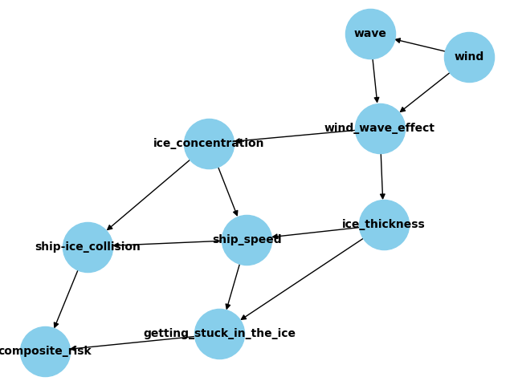

# Risk Assessment for Arctic Navigation

Navigating Arctic waters is fraught with risks like ice collision and ships getting stuck. We implemented a model based on [this research paper](https://doi.org/10.1016/j.tra.2020.10.017). The following is our simplified version of the Bayesian Network:

## CPTs
The conditional probability tables used to define the nodes in our network can be found [here](https://docs.google.com/spreadsheets/d/e/2PACX-1vTcjL6TH48RCD4CYsQP34CGzXqCWLilBH2m745rqOM5RyRk2JLee1qOhTkaEVoZFA/pubhtml). The values were filled according to the most plausible data which could be inferred from relationships described in the research.

